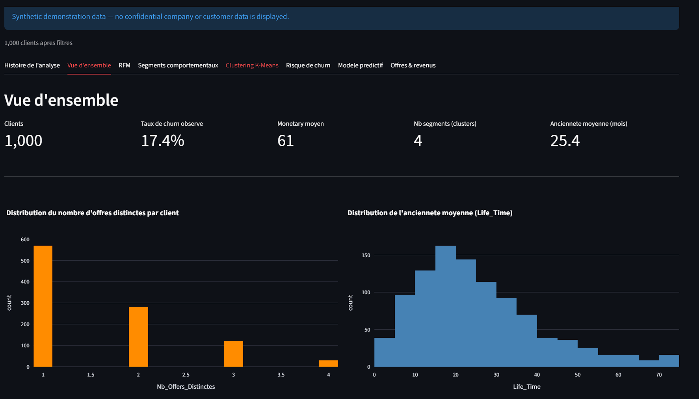
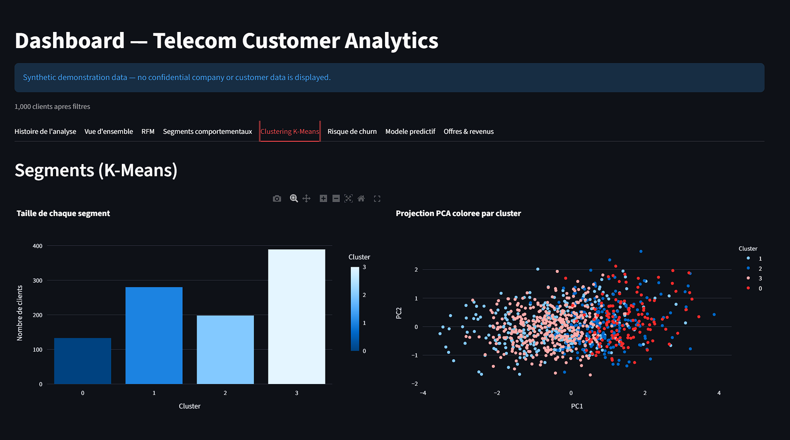
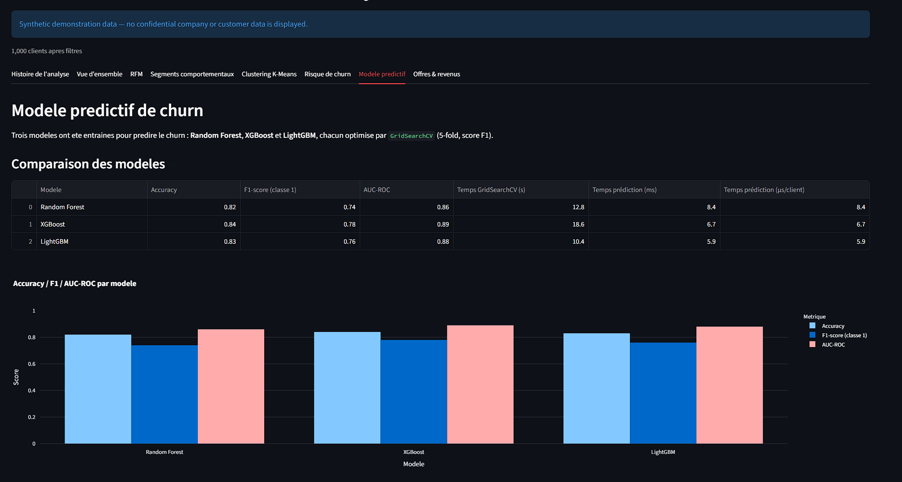

<div align="center">

# 📊 Telecom Customer Analytics

### Customer Segmentation · RFM · Clustering · Churn Modelling · Streamlit


**An end-to-end telecom customer analytics project combining behavioral segmentation, unsupervised learning, churn modelling and interactive visualization.**

</div>

---

## 📌 Overview

This project was developed during my internship in the telecommunications sector.

It focuses on two complementary customer analytics problems:

- **Customer segmentation** — identifying behavioral profiles within a telecom customer base.

- **Churn analysis** — studying patterns associated with customer inactivity and churn risk.

The project represents the continuation of an earlier proof of concept built using synthetic telecom subscriber data.

After working with the structure and challenges of real-world telecom data during my internship, I extended the initial approach into a broader analytics pipeline including:

- data cleaning and preprocessing,

- customer-level aggregation,

- exploratory data analysis,

- RFM segmentation,

- weighted RFM scoring,

- dynamic customer segmentation,

- K-Means clustering,

- cluster stability analysis,

- PCA visualization,

- DBSCAN exploration,

- churn modelling,

- model comparison and hyperparameter optimization,

- out-of-fold customer risk scores,

- feature importance analysis,

- and an interactive Streamlit dashboard.

> 🔒 **Confidentiality**

>

> The original internship analysis was performed using confidential telecom data.

> No proprietary dataset, personally identifiable customer information, internal customer identifiers or confidential company results are included in this repository.

---

## 🚀 Project at a Glance

\| Area | Methods |

\|---|---|

\| Data Preparation | Cleaning, missing values, date processing, aggregation |

\| Customer Analysis | RFM, Weighted RFM |

\| Behavioral Segmentation | RFM-based customer profiles |

\| Dynamic Analysis | RFM evolution and transition analysis |

\| Clustering | K-Means, DBSCAN |

\| Cluster Validation | Silhouette Score, Davies-Bouldin, ARI |

\| Dimensionality Reduction | PCA |

\| Churn Modelling | Random Forest, XGBoost, LightGBM |

\| Model Optimization | GridSearchCV, Cross-Validation |

\| Model Interpretation | Feature Importance |

\| Risk Scoring | Out-of-Fold Probabilities |

\| Dashboard | Streamlit, Plotly |

---

## 🔄 Project Evolution

This project builds on an earlier exploratory proof of concept:

### 🔗 [RFM Customer Segmentation — Telecom Subscriber Base](https://github.com/Malek-Lou/rfm-customer-segmentation)

### Phase 1 — Proof of Concept

The first project used fully synthetic subscriber data to explore the fundamentals of customer segmentation.

```text

Synthetic telecom data

        ↓

Exploratory analysis

        ↓

RFM segmentation

        ↓

K-Means clustering

        ↓

PCA

        ↓

Business interpretation

```

### Phase 2 — Internship Project

The internship project extended this approach to a more complete customer analytics workflow.

```text

Telecom transactional data

        ↓

Cleaning & preprocessing

        ↓

Customer-level aggregation

        ↓

RFM analysis

        ↓

Weighted & dynamic segmentation

        ↓

K-Means / DBSCAN / PCA

        ↓

Churn modelling

        ↓

Model comparison

        ↓

Customer risk scoring

        ↓

Interactive dashboard

```

---

# 📊 Project Preview

> **Synthetic demo notice**

>

> The screenshots below were generated using fully synthetic demonstration data created only to illustrate the functionality of the project.

>

> They do **not** reproduce confidential customer data, company distributions, business results or internship model performance.

## Dashboard Overview

<p *align*="center">

  

</p>

The dashboard provides a high-level view of the customer base, including customer volume, observed churn, monetary behavior, cluster count and customer tenure.

---

## Customer Clustering — K-Means & PCA

<p *align*="center">

  

</p>

K-Means clustering is used to identify groups of customers with similar behavioral characteristics.

PCA provides a two-dimensional representation of the customer space, making the resulting cluster structure easier to visualize.

---

## Churn Model Comparison

<p *align*="center">

  

</p>

Random Forest, XGBoost and LightGBM are compared using classification metrics such as Accuracy, F1-score and ROC-AUC.

> The values visible in this screenshot are synthetic demonstration results and do not represent the confidential internship results.

---

# 🎯 Objectives

## 1. Customer Segmentation

The first objective is to transform transactional and subscription information into interpretable customer profiles.

Customer behavior is summarized using indicators such as:

- **Recency** — how recently the customer performed a relevant activity,

- **Frequency** — how frequently the customer performed transactions,

- **Monetary Value** — the customer's financial contribution,

- customer lifetime,

- subscription information,

- number of offers,

- purchase behavior,

- and derived behavioral indicators.

The goal is to distinguish customer profiles and better understand differences in engagement and value.

---

## 2. Churn Analysis

The second objective is to study behavioral patterns associated with churn or prolonged inactivity.

Several supervised machine-learning approaches are compared to determine how well customer-level variables can distinguish between customer profiles associated with the business-defined churn condition.

This complements segmentation:

> **Segmentation asks:**  

> What types of customers exist in the customer base?

> **Churn modelling asks:**  

> Which behavioral characteristics are associated with churn risk?

---

# 🗂️ Data

The original internship dataset is **not distributed with this repository**.

The internal dataset contained customer- and subscription-level records including variables related to:

- customer identifiers,

- offers and subscriptions,

- activation dates,

- modification dates,

- deactivation dates,

- transaction dates,

- customer lifetime,

- service options,

- transaction amounts,

- and churn-related information.

The raw transactional records were cleaned and aggregated into customer-level analytical features before segmentation and modelling.

For confidentiality reasons, the repository focuses on the **analysis methodology and code**, while the original source data remains private.

---
### 🌐 [Try the Live Interactive Dashboard](https://telecom-customer-analytics-nhqhedgcrzcppg9llwrpvw.streamlit.app)

> The live application uses fully synthetic demonstration data.
> No confidential company or customer data is included.

# 🧠 Methodology

## 1. Data Preparation

The preprocessing pipeline includes:

- missing-value analysis,

- duplicate detection,

- date conversion,

- numerical type conversion,

- categorical processing,

- consistency checks,

- customer-level aggregation,

- and feature engineering.

Date variables are especially important because they are used to construct behavioral indicators such as customer recency and lifetime.

---

## 2. Exploratory Data Analysis

Exploratory analysis is performed before modelling to better understand the structure of the customer base.

The analysis includes:

- descriptive statistics,

- variable distributions,

- missing-value analysis,

- customer activity,

- offer distributions,

- transaction distributions,

- correlations,

- temporal evolution,

- and outlier inspection.

---

## 3. RFM Analysis

Customer behavior is summarized using three dimensions:

### Recency

Measures the time elapsed since the customer's most recent relevant transaction.

### Frequency

Measures the number of relevant transactions performed by the customer.

### Monetary Value

Measures the total financial contribution associated with the customer.

The three dimensions are transformed into scores and combined to obtain an interpretable customer ranking.

---

## 4. Weighted RFM

Traditional RFM gives similar importance to each dimension.

The project also explores a weighted version:

```text

Weighted RFM Score =

      wR × Recency Score

    + wF × Frequency Score

    + wM × Monetary Score

```

with:

```text

wR + wF + wM = 1

```

This allows the scoring methodology to reflect different analytical priorities.

For example:

- retention-oriented analysis may emphasize **Recency**,

- while value-oriented analysis may emphasize **Monetary Value**.

The resulting ranking can then be compared with the traditional RFM ranking.

---

## 5. Behavioral Segmentation

RFM scores are transformed into interpretable customer profiles.

The segmentation aims to distinguish groups such as:

- highly engaged customers,

- loyal customers,

- promising customers,

- customers requiring development,

- less-active customers,

- and customers requiring particular attention.

The objective is to combine quantitative scoring with interpretable behavioral profiles.

---

## 6. Dynamic RFM Analysis

Customer profiles are also studied over time.

The project explores:

- evolution of RFM behavior,

- changes in customer segments,

- and transition matrices between customer profiles.

This provides a dynamic view of customer behavior rather than relying exclusively on a single static segmentation.

---

## 7. Customer Value Analysis

Customer value concentration is analyzed using tools such as the **Lorenz curve**.

This helps evaluate how revenue is distributed across the customer base and whether a relatively small proportion of customers contributes a disproportionately large share of total value.

---

# 🔬 Unsupervised Learning

## 8. Feature Engineering

Additional customer-level indicators are derived before clustering.

These include variables related to:

- customer lifetime,

- average amount per transaction,

- purchase frequency normalized by tenure,

- monetary value normalized by tenure,

- and offer diversity.

---

## 9. K-Means Clustering

K-Means is used to identify customer groups directly from behavioral features.

Before clustering, numerical variables are standardized using `StandardScaler`.

Several candidate values of `K` are evaluated using:

- inertia,

- silhouette score,

- Davies-Bouldin index,

- and cluster interpretability.

---

## 10. Cluster Stability

Cluster stability is evaluated by running K-Means with different random initializations.

The **Adjusted Rand Index (ARI)** is used to measure agreement between cluster assignments.

This helps determine whether the identified segmentation is stable or highly dependent on random initialization.

---

## 11. Principal Component Analysis

**PCA** is used to reduce the dimensionality of customer profiles for visualization.

```text

Customer features

        ↓

Standardization

        ↓

PCA

        ↓

2D customer representation

```

This makes high-dimensional cluster structures easier to inspect visually.

---

## 12. DBSCAN

DBSCAN is explored as an alternative clustering technique.

Unlike K-Means, DBSCAN:

- does not require a predefined number of clusters,

- can identify irregularly shaped dense groups,

- and can detect potential outliers.

Its behavior is compared with the K-Means solution.

---

# 🤖 Churn Modelling

Three tree-based machine-learning approaches are compared.

## Random Forest

Random Forest provides:

- nonlinear modelling,

- interaction handling,

- robustness on tabular data,

- and feature importance.

## XGBoost

XGBoost is evaluated as a gradient-boosting approach capable of modelling more complex nonlinear relationships.

## LightGBM

LightGBM is evaluated as another efficient gradient-boosting implementation for structured data.

---

# 📏 Model Evaluation

The models are compared using classification metrics including:

- Accuracy

- Precision

- Recall

- F1-score

- ROC-AUC

- Confusion Matrix

- Classification Report

Particular attention is given to performance on the churn class rather than relying only on overall accuracy.

---

# ⚙️ Hyperparameter Optimization

`GridSearchCV` is used with cross-validation to compare different model configurations.

```text

Training data

      ↓

Cross-validation

      ↓

Hyperparameter search

      ↓

Selected configuration

      ↓

Model evaluation

```

This provides a more systematic model-selection process than relying only on a single configuration.

---

# 🔁 Out-of-Fold Risk Scores

Customer churn probabilities are generated using an **out-of-fold** approach.

Instead of producing a score for a customer using a model that was trained on that same observation, predictions are generated across cross-validation folds.

This reduces the risk of producing overly optimistic scores on the training data.

---

# 🔍 Feature Importance

Feature importance from the selected tree-based model is analyzed to understand which customer variables contribute most strongly to the model's decisions.

This connects predictive modelling back to behavioral interpretation.

---

# 🖥️ Interactive Dashboard

A Streamlit dashboard was developed to explore the analytical outputs interactively.

The application contains dedicated views for:

- analysis workflow,

- overall customer KPIs,

- RFM analysis,

- behavioral segmentation,

- K-Means clustering,

- churn risk,

- model comparison,

- feature importance,

- offers and revenue.

The dashboard accepts the analytical exports generated by the project. 

Run it locally with:

```bash

python -m streamlit run streamlit_app.py

```

---

# 🧪 Public Synthetic Demo

Because the real internship data cannot be shared, a synthetic-data generator is provided for demonstration purposes.

Run:

```bash

python generate_demo_data.py

```

This creates:

```text

demo_data/

├── clients_export.csv

├── model_comparison.csv

└── feature_importance.csv

```

Then start the dashboard:

```bash

python -m streamlit run streamlit_app.py

```

Upload the three generated files through the Streamlit sidebar.

The synthetic dataset exists only to demonstrate the interface and expected analytical workflow.

It is **not derived from the confidential internship data**.

---

# 🛠️ Tech Stack

### Programming & Environment

`Python` · `Jupyter Notebook`

### Data Processing

`Pandas` · `NumPy`

### Visualization

`Matplotlib` · `Seaborn` · `Plotly`

### Machine Learning

`Scikit-learn` · `XGBoost` · `LightGBM`

### Techniques

`RFM` · `Weighted RFM` · `K-Means` · `DBSCAN` · `PCA` · `ARI` · `Random Forest` · `Gradient Boosting` · `Cross-Validation` · `GridSearchCV`

### Application

`Streamlit`

---

# 📁 Project Structure

```text

telecom-customer-analytics/

│

├── assets/

│   ├── dashboard_overview.png

│   ├── clustering_pca.png

│   └── model_comparison.png

│

├── demo_data/

│   ├── clients_export.csv

│   ├── model_comparison.csv

│   └── feature_importance.csv

│

├── analyse.ipynb

├── streamlit_app.py

├── generate_demo_data.py

├── requirements.txt

├── README.md

├── NOTICE.md

├── .gitignore

└── .env.example

```

---

# ⚡ Installation

## 1. Clone the repository

```bash

git clone https://github.com/Malek-Lou/telecom-customer-analytics.git

cd telecom-customer-analytics

```

## 2. Create a virtual environment

```bash

python -m venv .venv

```

### Windows

```bash

.venv\Scripts\activate

```

### Linux / macOS

```bash

source .venv/bin/activate

```

## 3. Install the dependencies

```bash

pip install -r requirements.txt

```

The project uses Pandas, NumPy, Matplotlib, Seaborn, Scikit-learn, XGBoost, LightGBM, Jupyter, Streamlit and Plotly.

---

# 📓 Running the Original Analysis

Launch Jupyter:

```bash

jupyter notebook

```

Then open:

```text

analyse.ipynb

```

The original internship dataset is not distributed with the repository.

Therefore, the complete original analysis cannot be reproduced publicly without a dataset following the expected structure.

---

# ⚠️ Limitations

The churn component should be interpreted carefully.

The model is primarily **diagnostic rather than a true forward-looking churn forecasting system** because the explanatory variables and churn definition are derived from the same historical analysis window.

A true predictive churn system would require:

1. defining a historical cutoff date,

2. computing customer features using only information available before that date,

3. defining churn over a future observation window,

4. and evaluating the model on customers whose future behavior was not available during feature construction.

The analysis also takes precautions against direct leakage, but some behavioral variables may remain naturally correlated with the churn definition.

This limitation is important when interpreting model scores and customer risk probabilities.

---

# 💡 Key Takeaways

This project demonstrates the progression from a relatively simple segmentation experiment toward a broader **customer analytics workflow**.

It combines:

```text

Customer behavior

        +

Business segmentation

        +

Unsupervised learning

        +

Supervised learning

        +

Model validation

        +

Interactive visualization

```

The project also highlights that customer segmentation and churn modelling answer different but complementary questions.

### Customer Segmentation

> What types of customers exist in the customer base?

### Churn Modelling

> Which behavioral characteristics are associated with customer churn or inactivity?

Together, they provide a richer understanding of customer behavior.

---

# 🔒 Confidentiality

This repository is intended as a **technical portfolio presentation of the methodology developed during my internship**.

It does **not** contain:

- the original company dataset,

- personally identifiable customer information,

- real customer identifiers,

- confidential customer-level results,

- proprietary internal documents,

- real company performance metrics,

- or confidential business information.

The public screenshots and demo CSV files use fully synthetic data.

---

# 🔗 Previous Project

The initial exploratory version of this work, developed entirely using synthetic telecom data, is available here:

### [RFM Customer Segmentation — Telecom Subscriber Base](https://github.com/Malek-Lou/rfm-customer-segmentation)

The first repository focuses primarily on RFM segmentation and K-Means clustering.

This repository represents the broader continuation developed during the internship, extending the project toward dynamic segmentation, clustering validation, churn modelling and interactive analytics.

---

# 👤 Author

**Malek Louati**

Applied Mathematics and Modelling Engineering Student  

Polytech Nice Sophia

[GitHub — Malek-Lou](https://github.com/Malek-Lou)